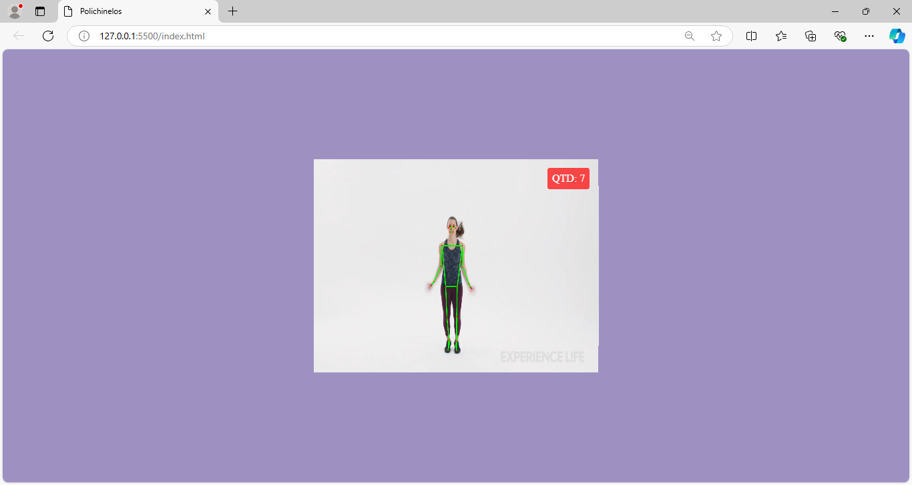
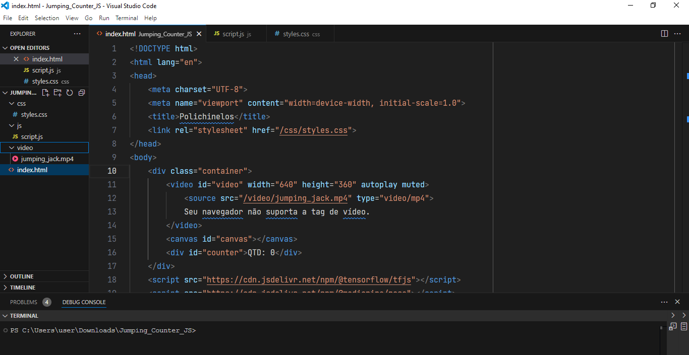

<h2 align="center"> 💻 Deteccao_obj_MediaPipe_JS_Tensorflow </h2>
<br>

<h4 align="center"> 💻 A Jump Counter project that uses computer vision to count jumping jacks in a video, using JavaScript, HTML, CSS, TensorFlow and MediaPipe. The application detects body landmarks and counts the number of jumping jacks based on the distance between the hands and feet.</h4>
<br>

---
## Deteccao_obj_MediaPipe_JS_Tensorflow
- This project utilizes JavaScript, HTML, CSS, TensorFlow, OpenCV, and MediaPipe to count the number of jumping jacks performed in a video. The application recognizes the position of the feet and hands, enabling accurate counting of the exercises.

---

<h4 align="center">Face Detection Project with face-api and JS 🚀</h4>

<div align="center">
    
    
</div>

---

## Features
- Real-time video capture and pose analysis.
- Jumping jack counting based on the distance between hands and feet.
- Visual interface with a counter that updates with each detected jumping jack

---

## Technologies Used
- **JavaScript**: The programming language used to implement the application logic.
- **HTML**: The structure of the web page.
- **CSS**: Styling for the interface.
- **TensorFlow.js**: A library for performing machine learning operations directly in the browser.
- **MediaPipe**: A Google library for video processing and pose detection.
- **OpenCV**: A computer vision library; while not explicitly mentioned in the code, integration with MediaPipe provides similar functionalities.

---

## Open the HTML File:
 - Open index.html in a modern browser that supports the <video> tag and the libraries used.

---

## Play the Video:
 - The video will automatically start playing. The counting of jumping jacks will be displayed on the counter.
---

## Project Structure

```bash

 jumping-jack-counter/
├── index.html          # Main HTML file
├── css/
│   └── styles.css     # Page styles
└── js/
    └── script.js      # Application logic

```
---

## Example Logic

 - The core logic of the project uses MediaPipe to detect body landmarks and calculates the distance between hands and feet to count jumping jacks. The counter updates every time a jumping jack is detected.

 ```bash

  // Initialize video and canvas
const videoElement = document.getElementById("video");
const canvasElement = document.getElementById("canvas");
const canvasCtx = canvasElement.getContext("2d");

// Jumping jack counter
let counter = 0;
// Previous state of movement
let lastState = null;

// Pose model setup
const pose = new Pose({
  locateFile: (file) => `https://cdn.jsdelivr.net/npm/@mediapipe/pose/${file}`,
});

// Other important configurations and functions omitted for brevity...

```

---


## How to Use
1. **Clone the Repository**:
   ```bash
   git clone https://github.com/ludiemert/Deteccao_obj_MediaPipe_JS_Tensorflow.git
   cd jumping-jack-counter
      ```

---

## Contribution
Feel free to contribute to this project! To do so, fork the repository, make your changes, and submit a pull request.


---
## License
- This project is licensed under the MIT License.
---


### 📦 Contribution

 - Feel free to contribute by submitting pull requests or reporting issues.

 ----

- #### My LinkedIn - [](https://www.linkedin.com/in/lucianadiemert/)

#### Contact


#### [**Luciana Diemert**](https://github.com/ludiemert)

🛠 Full-Stack Developer <br>
🖥️ Python Enthusiast | Computer Vision | AI Integrations <br>
📍 São Jose dos Campos – SP, Brazil

<a href="https://www.linkedin.com/in/lucianadiemert" target="_blank"></a>&nbsp;
<a href="mailto:lucianadiemert@gmail.com" target="_blank"></a>&nbsp;
<a href="#"></a>&nbsp;
<a href="https://www.github.com/ludiemert" target="_blank"></a>&nbsp;

<br clear="left"/>
